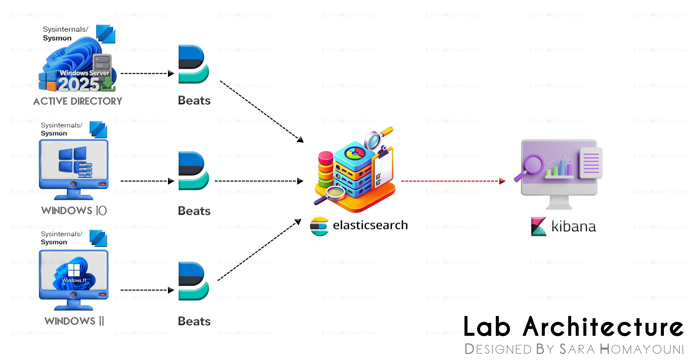
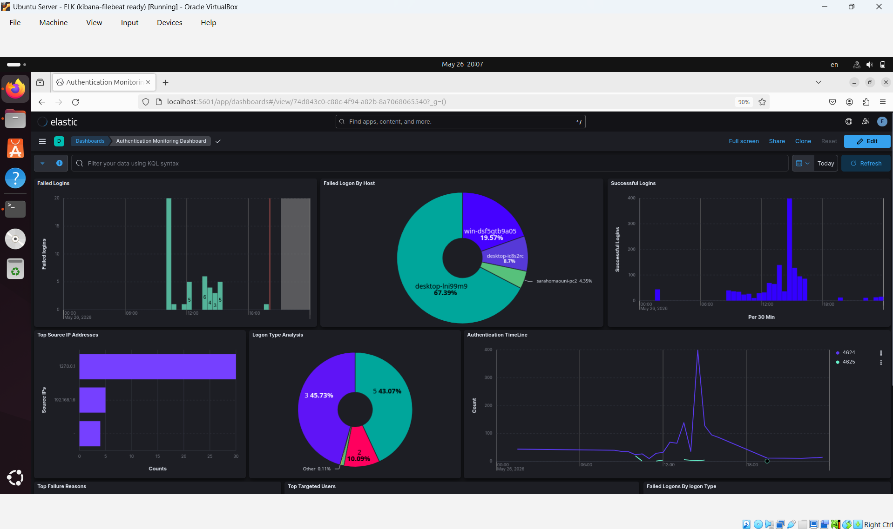
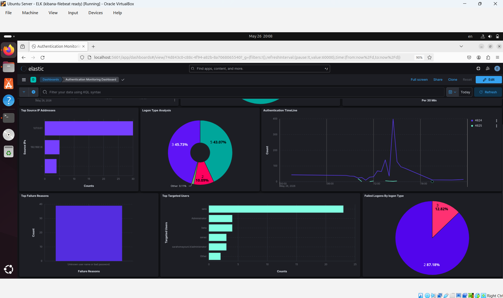
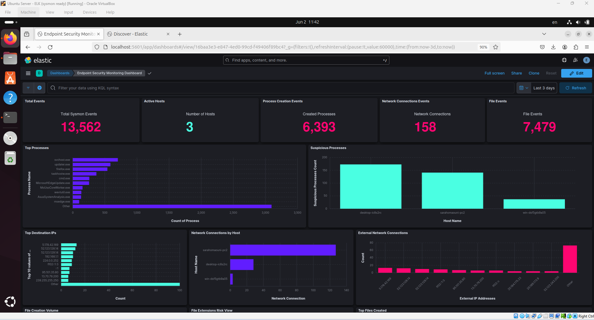
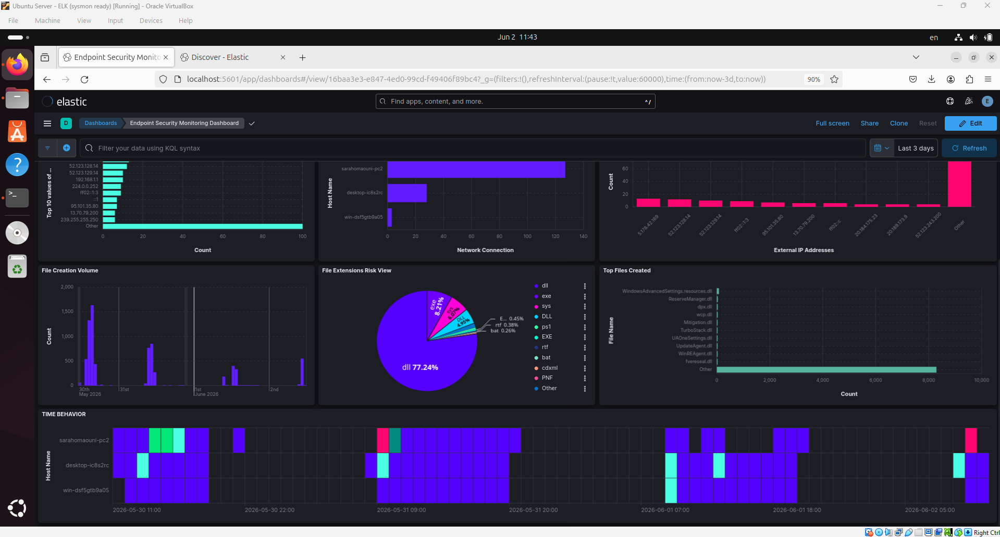
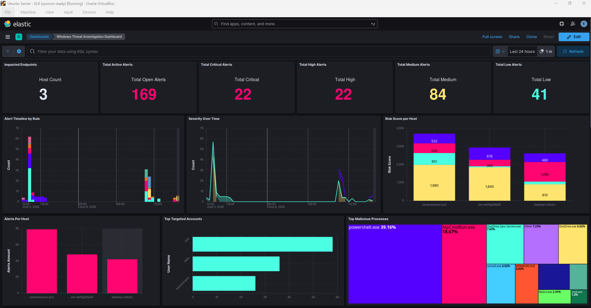
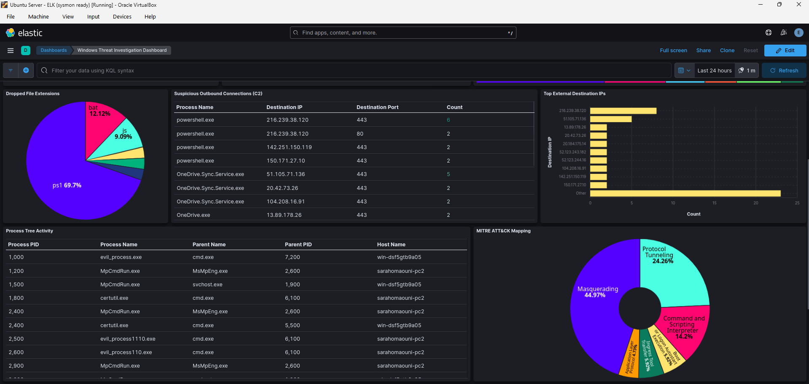
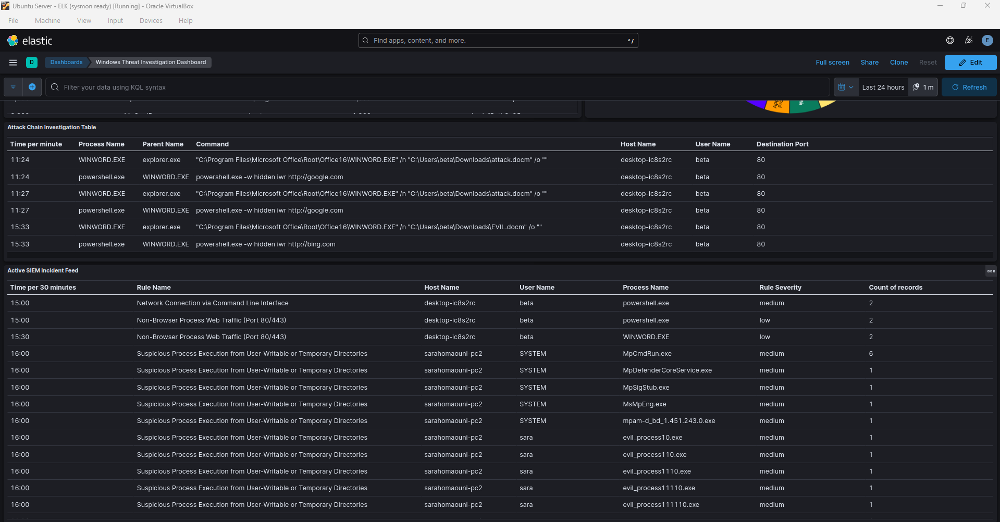
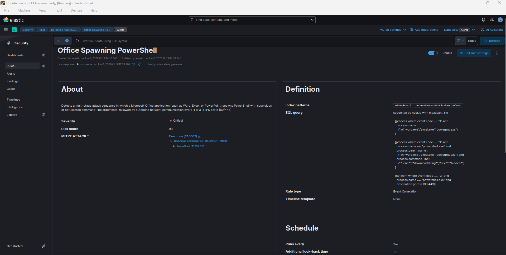

# Elastic Windows hreat Detection Lab (SOC)

A hands-on Windows threat detection and security monitoring laboratory built using the Elastic Stack, Sysmon telemetry, and custom SIEM detection rules.
This project focuses on behavioral threat detection, Windows endpoint monitoring, authentication visibility, and SOC-oriented security analytics using Elasticsearch and Kibana.
The lab simulates a lightweight SOC detection environment capable of identifying suspicious process execution, command-line abuse, persistence techniques, outbound network activity, and multi-stage attack chains.

## Technologies

- Elasticsearch 8.13
- Kibana 8.13
- Filebeat 9.4.1
- Sysmon (System Monitor)
- Winlogbeat 9.4.1
- Windows Event Logs
- Docker

## Lab Architecture

Windows Hosts -->  Sysmon   -->  Windows Event Logs    -->  Filebeat/Winlogbeat  --> Elasticsearch   --> Kibana

## Objectives

- Centralized Windows security log collection
- Authentication monitoring and visibility
- Endpoint telemetry analysis
- Behavioral threat detection
- Command-line abuse detection
- Suspicious process execution monitoring
- Network activity monitoring
- File activity analysis
- MITRE ATT&CK mapping
- Attack chain correlation
- SOC-style security analytics
- Risk-based alert visibility

## Dashboards

### Authentication Monitoring Dashboard

This dashboard focuses on Windows authentication activity and login-related events.

#### Dashboard Components
- Failed Logins
- Successful Logins
- Authentication Timeline
- Top Targeted Users
- Top Source IP Addresses
- Logon Type Analysis
- Failed Logins by Host
- Top Failure Reasons

### Endpoint Security Monitoring Dashboard

This dashboard uses Sysmon telemetry to provide endpoint-level visibility into system activity and behavioral monitoring.

To keep the lab lightweight and focused, the current version monitors three high-value Sysmon event categories:

- Event ID 1 : Process Creation 
  Used to monitor executed processes, command-line activity, suspicious applications, and process behavior.
- Event ID 3 : Network Connections 
  Used to monitor Outbound network activity, Destination IP addresses, External communication behavior and Potential C2 connections.
- Event ID 11 : File Creation 
  Used to monitor File creation activity, Suspicious file drops, Script and executable creation and File extension analysis.

Together, these event categories provide visibility across three critical SOC monitoring areas:

- Process activity
- Network activity
- File activity

Additional Sysmon event IDs such as DNS queries, registry modifications, image loads, and driver activity can be integrated in future versions of the lab. can be integrated in future versions of the lab.

#### Dashboard Components

- Total Events 
- Active Hosts
- Process Creation Events
- Network Connection Events
- File Events
- Top Processes
- suspicious Processes
- Top Destination IPs
- Network connections by Host
- External Network Connections
- File Creation Volume
- File Extensions Risk View
- Top Files Created
- Time Behavior

## Windows Threat Investigation Dashboard

The Windows Threat Investigation Dashboard focuses on SOC-oriented detection engineering and behavioral analytics using custom KQL and EQL rules.

The dashboard is designed to identify suspicious execution behavior, persistence mechanisms, living-off-the-land binary abuse, outbound network activity, and correlated attack chains.

#### Dashboard Components

- Dashboard Components
- Impacted Endpoints
- Total Active Alerts
- Critical Alerts
- High Alerts
- Medium Alerts
- Low Alerts
- Alerts Timeline by Rule
- Risk Score per Host
- Top Targeted Accounts
- Suspicious Outbound Connections (C2)
- Dropped File Extensions
- Top Malicious Processes
- Process Tree Activity
- MITRE ATT&CK Mapping
- Top External Destination IPs
- Alerts per Host
- Severity Over Time
- Attack Chain Investigation Table
- Active SIEM Incident Feed

## Custom Detection Rules

The project includes multiple custom detection rules written using KQL and EQL.
Rules Overview:

### Detection Categories

#### Execution Detection
- Suspicious PowerShell execution
- Obfuscated command-line activity
- Office spawning PowerShell

#### Defense Evasion Detection
- Execution from Temp/AppData directories
- Suspicious archive and script drops
- LOLBins activity

#### Persistence Detection
- Startup folder persistence monitoring

#### Command and Control Detection
- Certutil ingress tool transfer
- Outbound shell connections
- Non-browser HTTP/HTTPS traffic
- LOLBins network communication

#### MITRE ATT&CK Coverage

The detection rules are mapped to MITRE ATT&CK techniques and tactics.

Covered tactics include:

- TA0002 — Execution
- TA0003 — Persistence
- TA0005 — Defense Evasion
- TA0011 — Command and Control
	
### Risk Scoring Model

The Threat Detection Dashboard uses the native Elastic Security severity and risk scoring model to prioritize suspicious activity and impacted endpoints.

Each detection rule is assigned:

- Severity Level
	- Critical
	- High
	- Medium
	- Low
- Risk Score
	Numeric risk-based prioritization score between 0 to 100.
A custom rule example:
Rules Overview:

### Detection Engineering Focus

This project emphasizes behavioral threat detection rather than static IOC-based detection.

Key focus areas include:

- PowerShell abuse
- LOLBins detection
- Suspicious process execution
- Multi-stage attack chains
- Persistence monitoring
- External network communication
- Behavioral analytics
	
## Future Improvements

- Threat intelligence enrichment- Elastic Agent integration for centralized telemetry collection
- Firewall and IDS/IPS telemetry integration
- Additional Sysmon event coverage
- Linux telemetry integration
- Leveraging Pre-built Rules 
- Advanced event correlation and attack chain analysis
- More Advanced and Practical Detection Dashboards
- SOAR and incident response workflow integration
- Automated incident enrichment
- Detection tuning and false positive reduction
- Advanced attack simulation scenarios
